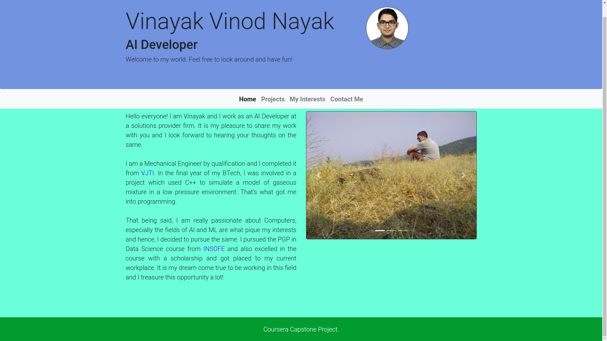
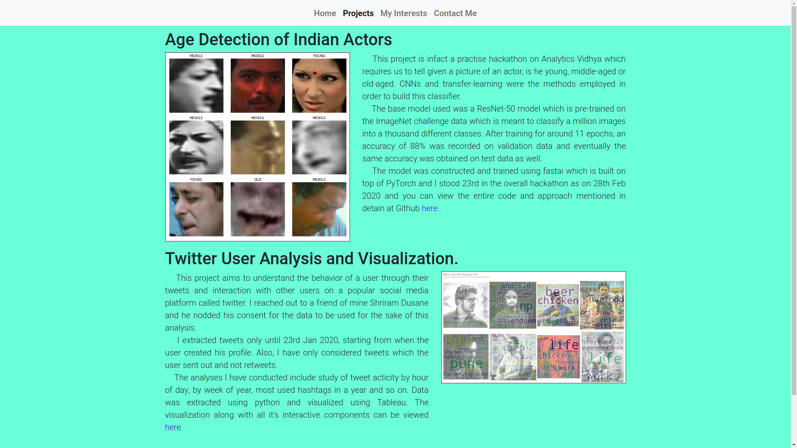
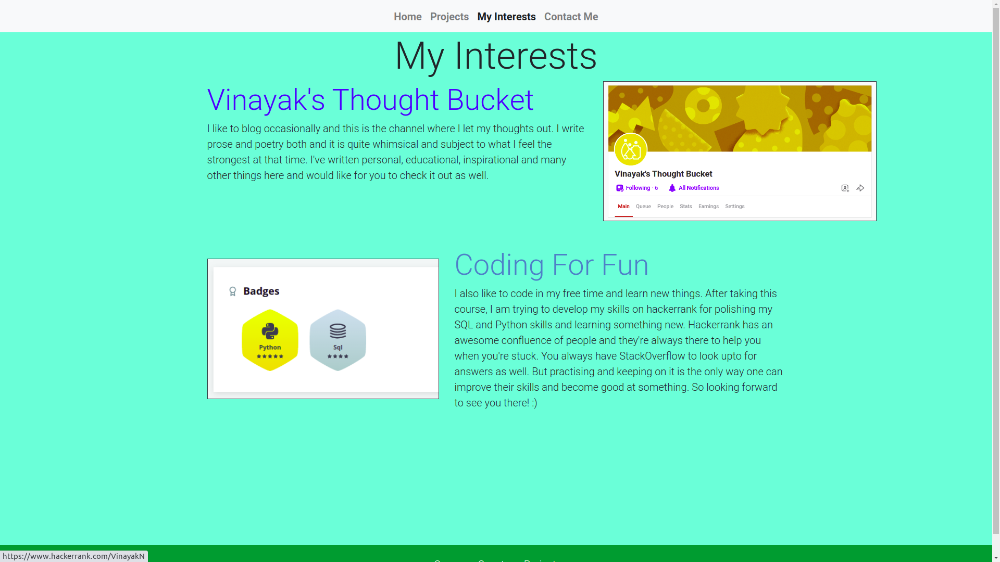
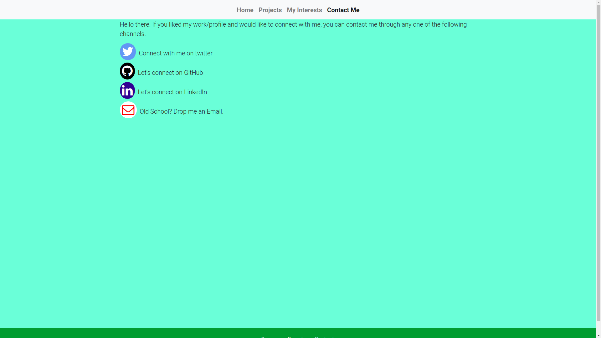
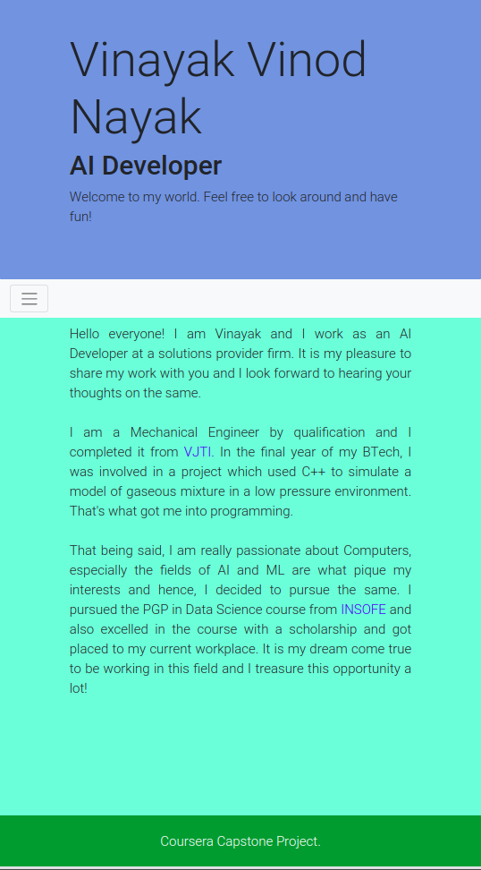
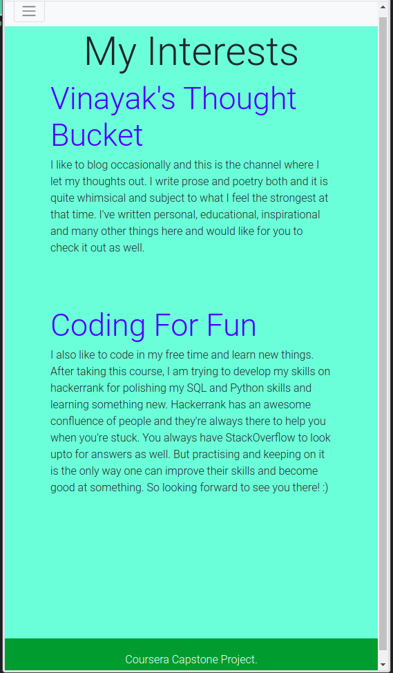
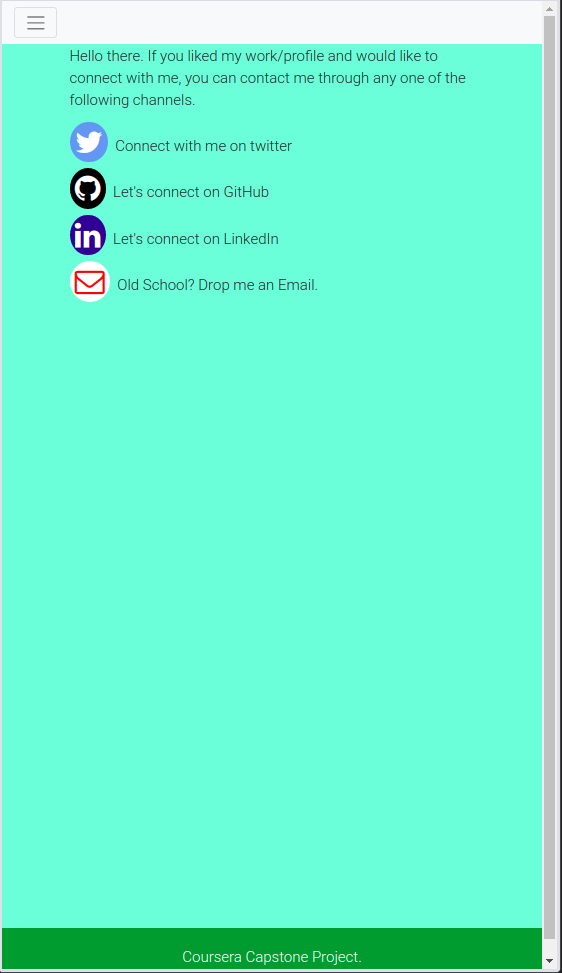
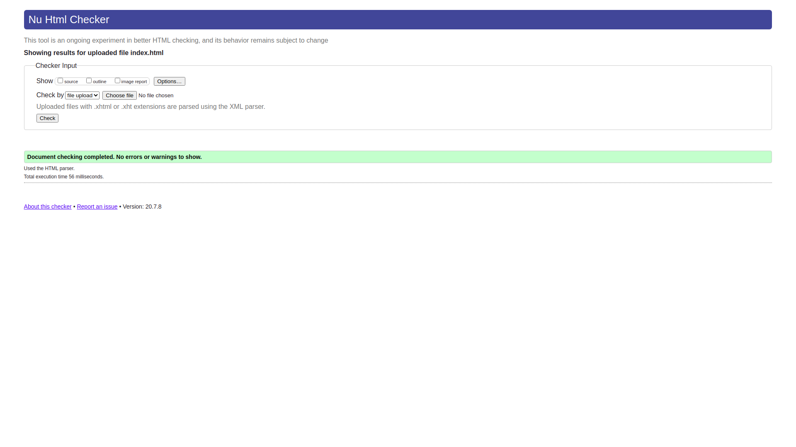

<h1 style="text-align:center">Web Design For Everbody Capstone Portfolio Report</h1>

This report aims to highlight the project completed in partial fulfilment of Web Design For Everybody Capstone project at Coursera conducted by University of Michigan. The report chronologically highlights four important points namely *Introduction, Responsiveness, validation, styling and enhancements.*

<h2>Introduction</h2>

The website aims to build a personal portfolio to demonstrate my projects, give an overview of my work and my interests hobbies etc. It is built using bootstrap 4 framework and HTML/CSS. I have validated my site using W3C and included sticky footer and carousel for enhancing my site. Also, using bootstrap and fluid measurements, the website has been made responsive to desktop and mobile views alike. Let's have a look at the website and check it's responsiveness in action.

<h2>Responsiveness</h2> 

The following snaps show the desktop view of the website.

  

    
  

  

    
  

  

    
  

  

    
  

There are four pages which portray

1. Introduction.
2. The projects that I've completed and explanation about the same.
3. What things interest me (My hobbies).
4. Contact Me (Contact details).

For a mobile view, the same pattern above changes and all images are not displayed. Also font-sizes and layout changes. They're as follows:4

  

    
  

  

    
  

  

    
  

<h2>Validation</h2>

All the web-pages when validated using the wave validator, show the following output:

This simply means that there aren't any issues with the designing of the website. All images have alt text, semantic tags are appropriately used and w3c validates the same.

<h2>Styling</h2>

The styling of these webpages is done with ***bootstrap classes and css stylesheets.*** 

  

    
  

  
 
   The styling of these webpages is done with bootstrap classes and css stylesheets.
      Some examples of bootstrap classes used are as follows:
	  <ul>
        <li>lead : To highlight paragraph text</li>
        <li>border-dark: To highlight border</li>
        <li>text-white: To color the text in white i.e. font color to be made white</li>
        <li>img-responsive: To make images responsive to screensize</li>
      </ul>
      and many more.
    Also, there's a lot of css styling used for the icons, footer, background and so on. A snapshot of the same could be seen aside. 
      <ul>
          <li>Footer Styling: The footer is styled to be stuck to the bottom to manifest this website as a Capstone Project Requirement.</li>
          <li>Font awesome icons styling for different icons used in the Contact Us page.</li>
          <li>Pseudo classes are used to change the opacity and text decoration of anchor links andd opacity of the icon images respectively.</li>
      </ul>
            

  

<h2>Enhancements</h2>

- I have included carousel in my homepage to view different images in a slidable format.
- A sticky footer is added to manifest the reason of creation for this website.
- Validated and enhanced accessibility of Webpage using WebAim
- Used pseudo-classes in order to create sticky footers and add interactivity like hover opacity change and hover decoration change for links and fontawesome icons.
